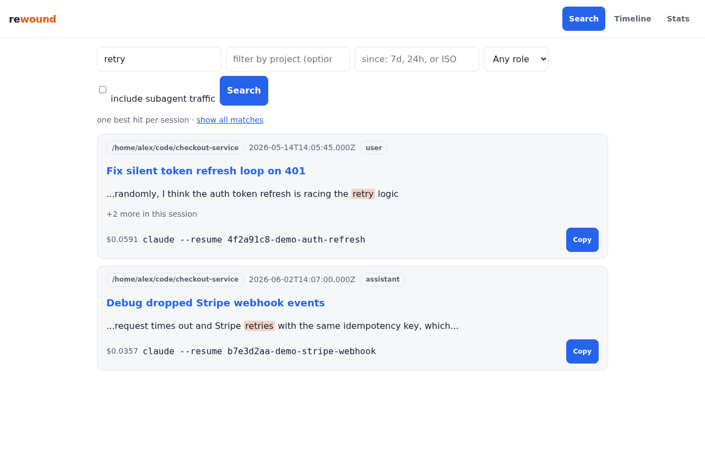
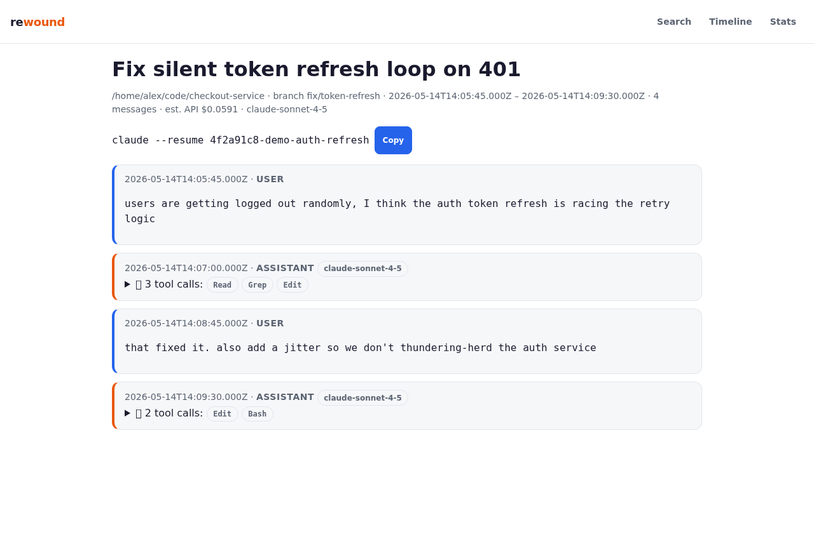
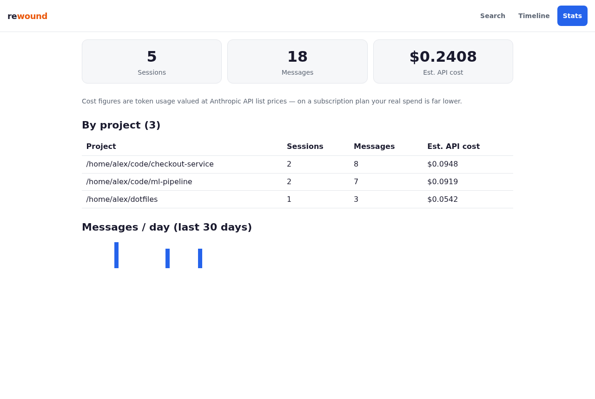
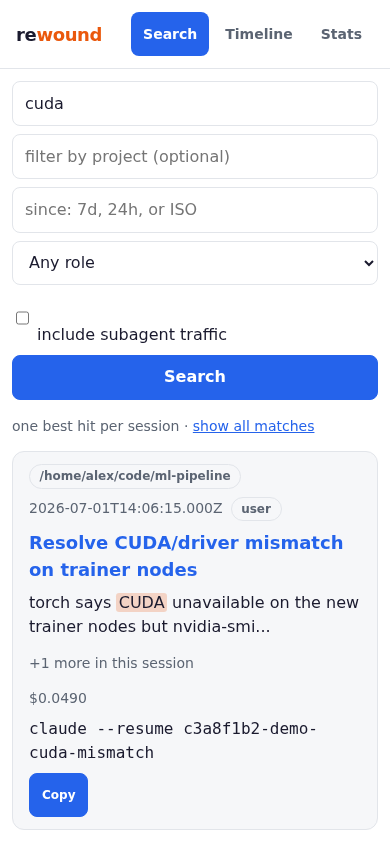

# rewound

Grep for everything your AI coding agents ever did.

## The problem

Heavy users of coding agents accumulate gigabytes of session transcripts that are effectively write-only memory:

- **No search.** Claude Code and Codex CLI have no cross-session full-text search. Finding "the session where we fixed the auth bug" means manual archaeology through JSONL files.
- **History is perishable.** Claude Code deletes transcripts older than 30 days by default (`cleanupPeriodDays`, swept at startup) — your reasoning history evaporates.
- **Agents can't remember.** Every new session rediscovers what a previous session already solved. Nobody serves the agent itself.

rewound indexes every session transcript on your machine — Claude Code, OpenAI Codex CLI, and OpenCode today, more harnesses next — into a local SQLite/FTS5 database and exposes it three ways: a CLI, an MCP server your agents can query directly, and a phone-friendly local web UI. Everything runs on your machine. Nothing leaves it.

## 60-second demo

```
$ rewound index
files scanned: 3310  new: 3310  updated: 0
messages indexed: 368687  parse errors: 1
elapsed: 29962ms

$ rewound search "fts5 trigger bug"
/home/dev/myapp · Fix fts5 trigger bug · 2026-07-01T10:00:05.000Z
found and fixed the **fts5** **trigger** bug by rewriting the AFTER UPDATE **trigger**
  ↳ resume: claude --resume 3f1a2c9e-...

(1 hit in 5ms)
```

Those numbers are real, from indexing a working machine's actual Claude Code history: 3,310 session files / 2+ GB / 368,687 messages, cold-indexed in 30 seconds (target was 5 minutes), incremental re-index in 148ms (target 5s), search in single-digit milliseconds (target 100ms).



Your own words rank above tool output that merely mentions the term, results are grouped one-per-session (`+N more in this session`), and every hit carries a one-tap resume command. More recall stories in [docs/use-cases.md](docs/use-cases.md).

<details>
<summary>More screenshots: session transcript · stats · phone</summary>





</details>

## Install

```bash
npm install -g rewound
rewound index
```

Or with Homebrew: `brew install dashorama/tap/rewound`. Or without installing anything:
`npx rewound index`. Node 20+ required. The CLI is also installed as `rw` — same
commands, fewer keystrokes (`rw search "auth bug"`).

<details>
<summary>Build from source</summary>

```bash
git clone <this-repo> && cd rewound
npm install
npm run build
node dist/cli.js index          # or: npm link, then `rewound index`
```

</details>

By default rewound reads `~/.claude/projects/**/*.jsonl`, Codex CLI sessions from `~/.codex/sessions`, and OpenCode's session database from `~/.local/share/opencode` (read-only — it never modifies your transcripts, and OpenCode's shared SQLite DB is opened strictly read-only even if OpenCode is writing to it concurrently) and writes its own database to `~/.rewound/rewound.db`. Override roots with `--roots` / `--codex-roots` / `--opencode-roots`, and the DB path with `--db <path>` or `REWOUND_DB=<path>`.

### Multi-machine: your history follows you

If you work across machines, two commands per machine give you one merged history with
zero servers involved:

```bash
rewound sync ~/GoogleDrive/rewound   # once: any folder your machines already share
rewound auto --install               # keeps index + sync fresh via cron, hourly
```

That's the whole setup. The folder is remembered after the first run — from then on bare
`rewound sync` (and the cron entry `rewound auto` installs) just works. Any shared folder
qualifies: Google Drive, Dropbox, Syncthing, a private git repo you pull/push, a mounted
NAS.

How it works: each machine writes its own snapshot (`<hostname>.rewound.db`) into the
folder and merges everyone else's — the richer copy of a session wins and repeat runs are
no-ops. Because every host only ever writes its own file, eventually-consistent syncers
like Drive and Dropbox never see write conflicts. `rewound merge <file.db>` is the
underlying primitive if you'd rather move snapshots by hand (scp, USB stick).

**No shared folder? Using object storage (S3, Supabase Storage, R2...)?** The easy road
is still any file-sync client. If you'd rather use a bucket, wrap the sync in two rclone
copies (Supabase Storage is S3-compatible — create S3 access keys in project settings →
Storage, then `rclone config` an S3 remote with your project's storage endpoint):

```bash
rclone copy bucket:rewound ~/.rewound/sync   # pull other machines' snapshots
rewound sync ~/.rewound/sync                 # merge + write this machine's snapshot
rclone copy ~/.rewound/sync bucket:rewound   # push
```

Put those three lines in cron and it's just as automatic — no mounts needed.

Privacy stance unchanged: rewound itself never opens a network connection — *you* choose
the transport, and your data only ever lands on storage you control.

### Your history outlives Claude Code's cleanup

Claude Code deletes transcripts older than ~30 days at startup. rewound's index is permanent: once a session is indexed, it stays searchable even after the source file is gone (it's kept as an *archived* session). Anything from before you started indexing is already unrecoverable — so the best moment to run `rewound index` is now, and then let `rewound auto --install` keep it fresh hourly. Incremental runs take well under a second when little has changed.

## The surfaces

### CLI — available now

```
rewound index [--roots <dir...>] [--db <path>] [--json]
rewound search <query> [--project <substr>] [--since <ISO|7d|24h>] [--role user|assistant] [--sidechains] [--limit N] [--json]
rewound sessions [--project <substr>] [--limit N] [--json]
rewound show <session-id-or-prefix> [--json]
rewound stats [--json]
```

`search` supports relative time windows (`--since 7d`), project filtering, and role filtering. Query terms are quoted automatically so punctuation never throws an FTS syntax error; pass `--raw` if you want real FTS5 query syntax.

Results are built to be scanned by a human eye: your own words and the agent's prose rank above tool output that merely mentions the term (a `cat` of a file no longer buries the sentence where you actually discussed the bug), and each session appears once — its best hit plus a `+N more matches in this session` count. Pass `--all-matches` to disassemble a session into every matching message.

Two search tips from real-corpus testing: scope with `--project` when your memory is project-specific — cross-cutting terms (preferences, conventions, tool names) appear in *every* project's sessions and will drown an unscoped query. And run `rewound index` before hunting for recent work; indexing is incremental and takes well under a second when little has changed.

### MCP server — available now

`rewound mcp` starts a stdio MCP server so a Claude Code agent can search its own history mid-session — the moat feature. Three tools:

- `search_history({query, project?, since?, limit?, all_matches?})` — ranked excerpts (≤700 chars each) with session id/title/date, one best hit per session by default, and a hint to fetch more context.
- `get_session_summary({session_id})` — title, project, dates, message count, tools/models used, first prompt and last response (truncated).
- `get_session_excerpt({session_id, match_uuid?, context?})` — the matched message plus surrounding context, readable.

Every response is capped near 8KB so agent context isn't blown out by a single tool call. Add it to your Claude Code MCP config:

```json
{ "mcpServers": { "rewound": { "command": "npx", "args": ["-y", "rewound", "mcp"] } } }
```

(Running from a source checkout instead? Point `command`/`args` at your local build, e.g. `"command": "node", "args": ["/path/to/rewound/dist/cli.js", "mcp"]`.)

### Web UI — available now

`rewound serve` starts a local, phone-friendly web UI: full-text search with filters, readable session transcripts with one-tap resume-command copy, per-project timeline, and cost rollups.

```
rewound serve                  # http://127.0.0.1:4321
rewound serve --host 0.0.0.0   # reachable over Tailscale — search your history from your phone
```

Server-rendered with zero frontend build step, colorblind-safe palette (blue/orange, no red/green status pairs), and everything — including clipboard copy — works over plain HTTP on your tailnet.

## Privacy

100% local. No telemetry, no network calls, no account. Your transcripts never leave your machine — rewound reads `~/.claude/projects` read-only and writes its own database to `~/.rewound/rewound.db`. Even "archive mode" (kept history after Claude Code prunes the source file) lives entirely in your local SQLite file.

## Cost estimates

`rewound stats` and search results include an **estimated** cost per session, computed from a static $/Mtok table (updated by hand, not live pricing). Treat it as a rough API-equivalent value, not a bill.

## Roadmap

More harness adapters are next: Copilot CLI is mapped (see repo issues/roadmap). Keyword-first search is deliberate for v0.x — it's fast, local, and predictable. Local hybrid/semantic search (vector index built with a local embedding model, no API keys, fused with FTS ranking) is planned once the keyword surface has proven itself; the gap it closes is vocabulary mismatch ("that time the port was already taken" vs `EADDRINUSE`).

## License

Source-available and **free for personal use**. Terms for commercial/team use are in [LICENSE](LICENSE).
